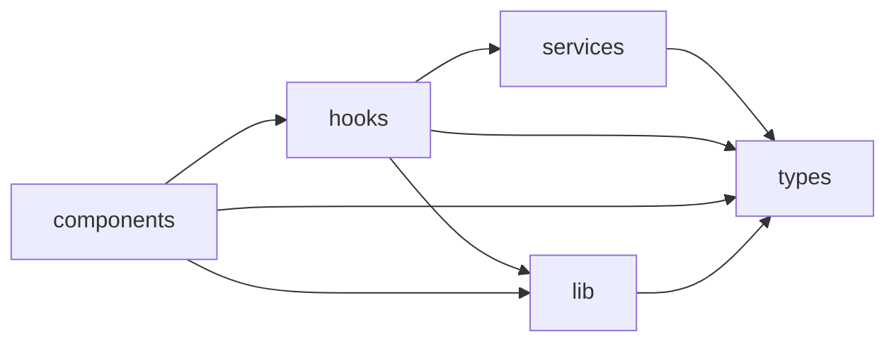
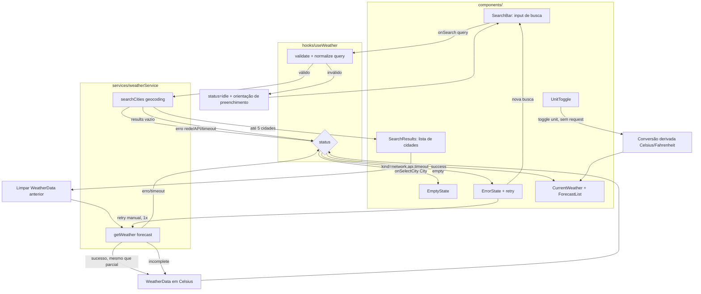
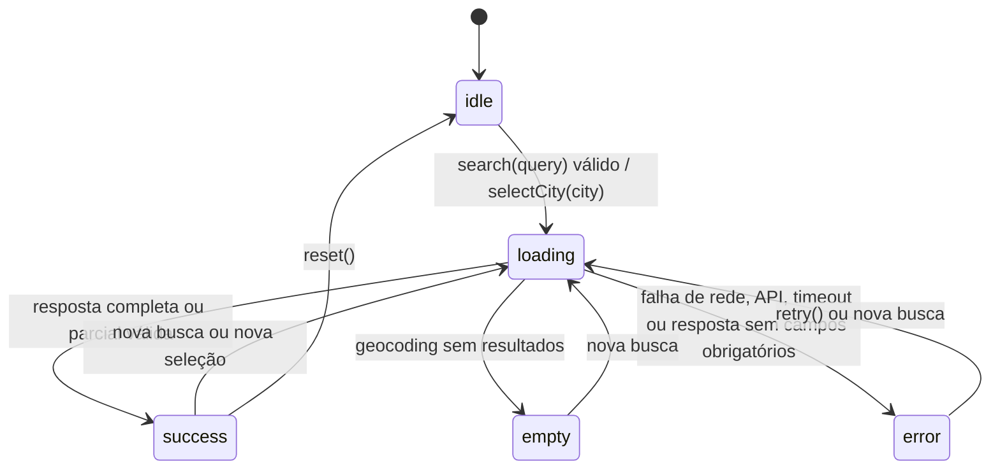

# Plano Técnico — Weather App

Este plano deriva de `specs/weather-app-spec.md` e define decisões de arquitetura e contratos para o MVP. Não inclui código de implementação.

## Architecture

### Overview

Aplicação SPA React com fluxo unidirecional e camadas pequenas:

- **Apresentação (`components/`)**: componentes acessíveis para busca, resultados, controles e estados visuais.
- **Orquestração (`hooks/`)**: `useWeather` coordena busca, seleção, carregamento, retry, timeout e dados.
- **Acesso a dados (`services/`)**: única camada que conhece URLs e formatos da Open-Meteo; seus adaptadores são mockáveis.
- **Transformações puras (`lib/`)**: conversão de temperatura, formatação no fuso retornado e tradução dos códigos WMO.
- **Contratos (`types/`)**: tipos compartilhados entre serviços, hook e UI.

O fluxo exige seleção explícita de localidade e então carrega clima atual e previsão. Ao iniciar uma consulta para nova localidade, o estado meteorológico anterior é limpo. **Toda chamada a `services/` recebe um `AbortSignal` próprio do hook**; uma nova busca ou seleção cancela (via `AbortController.abort()`) qualquer requisição anterior ainda em andamento, garantindo que respostas antigas não sobrescrevam a seleção mais recente (edge case "nova busca durante carregamento").

### Regra de dependência entre camadas



A dependência é sempre de fora para dentro: `components` conhece `hooks` e `lib`, mas nunca `services` diretamente; `hooks` conhece `services` e `lib`, mas não sabe a URL ou o formato bruto da Open-Meteo; `services` e `lib` não conhecem React. Essa direção única evita que detalhes de rede vazem para a UI e permite substituir qualquer camada isoladamente (ex.: trocar de provedor de clima sem tocar em `components`).

### Por que separar dessa forma

- **`components/` (apresentação):** recebem dados e callbacks via props, sem `fetch` nem regras de negócio. Ficam fáceis de testar com Testing Library apenas passando props/mocks, cobrindo loading, erro, vazio e sucesso sem rede real.
- **`hooks/` (orquestração/estado):** concentram a máquina de estados (`idle | loading | success | empty | error`), retry e cancelamento. Isolar a orquestração aqui permite testá-la com `renderHook` injetando um `WeatherService` fake, sem montar componentes nem UI.
- **`services/` (acesso a dados):** único lugar que conhece endpoints, parâmetros e formato de resposta da Open-Meteo. Pode ser testado com `fetch` mockado (sucesso, erro HTTP, timeout, payload incompleto) sem depender de React ou de rede real em CI.
- **`lib/` (funções puras):** conversão de temperatura, mapeamento de código WMO e formatação de data são funções sem efeitos colaterais. São as mais baratas de testar (entrada/saída determinística) e reaproveitáveis por `hooks` e `components`.
- **`types/` (contratos):** compartilhados por todas as camadas, garantindo que uma mudança de contrato quebre a compilação em vez de falhar silenciosamente em produção.

## Tech Stack

| Área | Tecnologia | Decisão |
| --- | --- | --- |
| Linguagem | TypeScript strict | Contratos explícitos e validação em compilação. |
| UI | React + Vite | SPA simples, rápida e adequada a deploy estático. |
| Estilo | Tailwind CSS | Responsividade mobile-first e tema visual do projeto. |
| Dados | Open-Meteo | Geocoding e forecast sem autenticação nem backend próprio. |
| Testes unitários | Vitest + Testing Library | Testes rápidos de funções, serviços, hooks e estados. |
| Testes E2E | Playwright | Fluxos reais em desktop/mobile e múltiplos navegadores. |
| Qualidade | Biome | Lint e formatação consistentes com os scripts do projeto. |
| Pacotes | pnpm | Gerenciador oficial do repositório. |

Não será usada biblioteca de estado, cache ou cliente HTTP adicional: o escopo é pequeno e `fetch` com `AbortController` é suficiente.

**NFR-04 (shell em até 2s):** Vite com build de produção padrão (tree-shaking, sem framework de estado adicional) já atende à meta em conexão móvel de referência; nenhuma otimização extra (code-splitting, lazy loading) é necessária para o escopo do MVP, mas o critério deve ser validado no Lighthouse/CI antes do release.

## Project Structure

```text
src/
├── components/
│   ├── SearchBar.tsx
│   ├── SearchResults.tsx
│   ├── CurrentWeather.tsx
│   ├── ForecastList.tsx
│   ├── ForecastCard.tsx
│   ├── UnitToggle.tsx
│   └── states/
│       ├── LoadingState.tsx
│       ├── EmptyState.tsx
│       └── ErrorState.tsx
├── hooks/
│   └── useWeather.ts
├── services/
│   └── weatherService.ts
├── lib/
│   ├── temperature.ts
│   ├── weatherCodes.ts
│   ├── date.ts
│   └── validation.ts
├── types/
│   └── weather.ts
├── styles/
│   └── globals.css
├── App.tsx
└── main.tsx
```

Rede, transformação e apresentação permanecem separadas para atender NFR-09 e permitir testes sem chamadas externas.

| Pasta | Responsabilidade | Conhece rede/React? | Como é testada |
| --- | --- | --- | --- |
| `components/` | Renderizar UI a partir de props; nenhum acesso a dados. | Conhece React, não conhece rede. | Testing Library com props/mocks; sem `fetch`. |
| `hooks/` | Orquestrar busca, seleção, retry, timeout e estado. | Conhece React e a interface de `services`, não a URL/formato bruto. | `renderHook` com `WeatherService` fake injetado. |
| `services/` | Chamar Open-Meteo e mapear resposta para os tipos do domínio. | Conhece rede, não conhece React. | `fetch` mockado (sucesso, erro, timeout, payload parcial). |
| `lib/` | Funções puras: conversão de unidade, códigos WMO, datas, validação. | Não conhece rede nem React. | Testes unitários simples de entrada/saída. |
| `types/` | Contratos compartilhados (`City`, `WeatherData`, etc.). | Nenhum. | Verificado indiretamente via compilação TypeScript. |

## Data Model

Os valores meteorológicos são armazenados em Celsius; a unidade é convertida somente ao preparar a apresentação. Campos opcionais usam `number | null` para distinguir ausência de zero válido.

```ts
// Unidade de temperatura ativa na UI; conversão é sempre derivada, nunca refeita via API.
type Unit = 'celsius' | 'fahrenheit';

// Localidade retornada pelo endpoint de geocoding da Open-Meteo.
interface City {
  id: number; // id do geocoding, usado para distinguir homônimos na lista
  name: string; // nome da localidade (results[].name)
  country: string; // nome do país (results[].country)
  admin1?: string; // estado/região, quando existir (results[].admin1)
  latitude: number; // coordenada usada na chamada de forecast
  longitude: number; // coordenada usada na chamada de forecast
  timezone?: string; // fuso IANA do geocoding (results[].timezone), quando presente
}

// Bloco `current` da resposta de forecast, já convertido para os tipos do domínio.
interface CurrentWeather {
  time: string; // current.time, no fuso da localidade (não o do dispositivo)
  temperatureC: number | null; // current.temperature_2m; null se ausente na resposta
  weatherCode: number | null; // current.weather_code (tabela WMO), mapeado em lib/weatherCodes
  humidityPercent: number | null; // current.relative_humidity_2m, em %
  windSpeedKmh: number | null; // current.wind_speed_10m, em km/h
  precipitationMm: number | null; // current.precipitation, em mm
}

// Uma posição do bloco `daily`, já "achatada" a partir dos arrays paralelos da API.
interface ForecastDay {
  date: string; // daily.time[i], data no fuso da localidade
  minTemperatureC: number | null; // daily.temperature_2m_min[i]
  maxTemperatureC: number | null; // daily.temperature_2m_max[i]
  weatherCode: number | null; // daily.weather_code[i] (tabela WMO)
  precipitationMm: number | null; // daily.precipitation_sum[i], em mm
}

// Agregado final consumido pela UI para uma cidade selecionada.
interface WeatherData {
  city: City; // localidade consultada
  timezone: string; // fuso IANA retornado pelo forecast (timezone=auto), fonte de verdade para datas
  fetchedAt: string; // instante local em que a resposta foi processada, usado no aviso de 30 min
  current: CurrentWeather; // clima atual
  forecast: ForecastDay[]; // sempre 5 posições: hoje + 4 dias seguintes
}
```

Contratos de serviço:

```ts
interface WeatherService {
  searchCities(query: string, signal?: AbortSignal): Promise<City[]>;
  getWeather(city: City, signal?: AbortSignal): Promise<WeatherData>;
}
```

O serviço rejeita respostas malformadas quando faltarem cidade, temperatura atual ou condição. Para forecast incompleto, mantém as cinco posições e representa valores ausentes como `null`.

## Data Flow



1. `SearchBar` envia o termo bruto ao hook; a normalização/validação ocorre em `useWeather` (mínimo dois caracteres não brancos, aparando espaços, tolerando caixa e acentuação). Termo inválido mantém `status=idle` e nunca chama `services/`.
2. Termo válido chama `weatherService.searchCities`; resposta sem `results` leva a `status=empty` (`EmptyState`), e não a erro técnico. Falha de rede, API ou timeout leva a `status=error` (`ErrorState`), com ação de retry manual único.
3. Seleção de uma `City` em `SearchResults` limpa o `WeatherData` anterior antes de chamar `weatherService.getWeather`, evitando misturar respostas de buscas diferentes.
4. `getWeather` em sucesso (mesmo com campos `null` por resposta parcial) resulta em `status=success` e popula `WeatherData` em Celsius; erro/timeout leva a `status=error`.
5. `CurrentWeather`/`ForecastList` renderizam a partir de `WeatherData` e da `unit` ativa; `UnitToggle` só atualiza a apresentação (conversão derivada), sem passar por `services/` nem alterar `status`.

## External APIs

### Geocoding

```text
GET https://geocoding-api.open-meteo.com/v1/search
  ?name={query}&count=5&language=pt&format=json
```

| Parâmetro | Papel na spec |
| --- | --- |
| `name` | Termo já aparado e validado (mínimo dois caracteres não brancos, FR-01). |
| `count=5` | Impõe o limite de no máximo cinco resultados (AC-FR01-05) diretamente na origem. |
| `language=pt` | Nomes de país/região em português, alinhado a NFR-01. |
| `format=json` | Formato de resposta padrão do serviço. |

Exemplo resumido de resposta:

```json
{
  "results": [
    {
      "id": 3448439,
      "name": "São Paulo",
      "country": "Brasil",
      "admin1": "São Paulo",
      "latitude": -23.5475,
      "longitude": -46.6361,
      "timezone": "America/Sao_Paulo"
    }
  ]
}
```

Se `results` estiver ausente, a resposta é tratada como lista vazia (estado vazio, AC-FR01-08), não como erro.

**Mapeamento para `City`:**

| Campo `City` | Origem em `results[]` |
| --- | --- |
| `id` | `id` |
| `name` | `name` |
| `country` | `country` |
| `admin1` | `admin1` (opcional; ausência não bloqueia o mapeamento) |
| `latitude` | `latitude` |
| `longitude` | `longitude` |
| `timezone` | `timezone` (opcional; o `timezone` definitivo vem do forecast) |

### Forecast

```text
GET https://api.open-meteo.com/v1/forecast
  ?latitude={latitude}&longitude={longitude}
  &current=temperature_2m,relative_humidity_2m,wind_speed_10m,precipitation,weather_code
  &daily=weather_code,temperature_2m_max,temperature_2m_min,precipitation_sum
  &forecast_days=5&timezone=auto
```

| Parâmetro | Papel na spec |
| --- | --- |
| `latitude`, `longitude` | Coordenadas da `City` selecionada (FR-02/FR-03). |
| `current=...` | Campos obrigatórios/opcionais do clima atual (FR-02): temperatura, umidade, vento, precipitação e condição. |
| `daily=...` | Campos da previsão de cinco dias (FR-03): condição, mínima, máxima e precipitação diária. |
| `forecast_days=5` | Garante hoje + quatro dias seguintes (AC-FR03-01). |
| `timezone=auto` | Faz a API resolver o fuso da localidade; base para datas/horários (AC-FR02-07). |

Exemplo resumido de resposta:

```json
{
  "timezone": "America/Sao_Paulo",
  "current": {
    "time": "2026-09-16T09:00",
    "temperature_2m": 21.4,
    "relative_humidity_2m": 68,
    "wind_speed_10m": 12.3,
    "precipitation": 0.0,
    "weather_code": 2
  },
  "daily": {
    "time": ["2026-09-16", "2026-09-17", "2026-09-18", "2026-09-19", "2026-09-20"],
    "weather_code": [2, 3, 61, 1, 0],
    "temperature_2m_max": [24.1, 22.8, 19.5, 23.0, 25.2],
    "temperature_2m_min": [15.2, 14.7, 13.9, 14.1, 15.8],
    "precipitation_sum": [0.0, 0.4, 6.2, 0.0, 0.0]
  }
}
```

Campos ausentes em `current` viram `null`; se `temperature_2m`, `weather_code` ou o próprio bloco `current` faltarem, a resposta é tratada como incompleta para o clima atual (AC-FR02-03). Índices ausentes em qualquer array de `daily` viram `null` naquela posição, sem descartar o dia (AC-FR03-04).

**Mapeamento para `CurrentWeather`:**

| Campo `CurrentWeather` | Origem em `current` |
| --- | --- |
| `time` | `current.time` |
| `temperatureC` | `current.temperature_2m` |
| `weatherCode` | `current.weather_code` |
| `humidityPercent` | `current.relative_humidity_2m` |
| `windSpeedKmh` | `current.wind_speed_10m` |
| `precipitationMm` | `current.precipitation` |

**Mapeamento para `ForecastDay[]`** (achatando os arrays paralelos de `daily`, índice a índice):

| Campo `ForecastDay` | Origem em `daily` |
| --- | --- |
| `date` | `daily.time[i]` |
| `minTemperatureC` | `daily.temperature_2m_min[i]` |
| `maxTemperatureC` | `daily.temperature_2m_max[i]` |
| `weatherCode` | `daily.weather_code[i]` |
| `precipitationMm` | `daily.precipitation_sum[i]` |

**Mapeamento para `WeatherData`:** `city` vem da `City` selecionada; `timezone` vem de `timezone` (nível raiz da resposta de forecast, não do geocoding); `fetchedAt` é o instante local em que a resposta foi processada (usado no aviso de 30 minutos, AC-FR02-06); `current` e `forecast` seguem os mapeamentos acima.

Toda requisição usa timeout de 10 segundos, `AbortController` e mensagens normalizadas para falha HTTP, rede e timeout. Nenhuma credencial é necessária.

## State Management

### Onde o estado vive

| Estado | Onde vive | Motivo |
| --- | --- | --- |
| Busca, seleção, dados meteorológicos, erro, retry | `useWeather` (hook), sem store global | É o único consumidor de `services/`; escopo pequeno não justifica Redux/Zustand. |
| `unit` (`celsius`/`fahrenheit`) | Estado local de UI no componente raiz (`App`) | É preferência de exibição, não dado de domínio; não deve disparar nova busca. |
| Componentes de apresentação | Sem estado próprio (exceto UI efêmera, ex.: foco) | Recebem tudo via props, o que os mantém testáveis isoladamente. |

```ts
type WeatherStatus = 'idle' | 'loading' | 'success' | 'empty' | 'error';

interface WeatherState {
  status: WeatherStatus;
  query: string;
  cities: City[];
  selectedCity: City | null;
  data: WeatherData | null; // sempre em Celsius; unit não entra aqui
  error: WeatherError | null;
  retryCount: number; // 0 ou 1; acima disso, retry manual fica indisponível
}

interface WeatherError {
  kind: 'validation' | 'network' | 'timeout' | 'api';
  message: string; // mensagem pronta para o usuário, em pt-BR
  canRetry: boolean;
}
```

> Resposta parcial/incompleta **não** é um `WeatherError.kind`: ela nunca bloqueia o status em `error`. Campos obrigatórios ou opcionais ausentes viram `null` dentro de `WeatherData` e o status permanece `success`; a UI decide, por campo, exibir "Indisponível". Isso evita a ambiguidade de um "erro" que nunca é de fato armazenado em `state.error`.

### Estados explícitos e transições



- **`idle`**: estado inicial e após `reset()`; nenhuma chamada de rede ainda ocorreu; UI orienta a pesquisar.
- **`loading`**: cobre busca de cidades e busca de forecast; dados anteriores (`data`, `cities`) são limpos ao iniciar consulta para nova localidade, para não misturar respostas.
- **`success`**: `data` populado (mesmo que com campos `null` internos); é o único estado em que `CurrentWeather`/`ForecastList` renderizam valores.
- **`empty`**: geocoding sem `results`; estado de domínio, não erro técnico.
- **`error`**: `error` populado com `kind`, `message` e `canRetry`; `data` permanece `null`.

`unit` não é parte de `WeatherState`: é um estado de UI paralelo, e por isso trocar de `celsius` para `fahrenheit` nunca dispara `loading`.

### Conversão de temperatura sem novo request

Todo valor de temperatura é **armazenado em Celsius** em `WeatherData` e a conversão é **derivada na renderização**, nunca persistida no estado:

```ts
function displayTemperature(celsius: number | null, unit: Unit): number | null {
  if (celsius === null) return null; // preserva indisponibilidade, não converte null
  const value = unit === 'fahrenheit' ? celsius * 9 / 5 + 32 : celsius;
  return Math.round(value); // arredondamento ao inteiro mais próximo, conforme FR-04
}
```

Como `unit` é lido a cada render e `WeatherData` não muda quando `unit` muda, o toggle:

- não chama `search`, `selectCity` nem `retry`;
- não gera nenhuma requisição de rede (atende NFR-04, atualização em até 100 ms);
- nunca deixa um valor com a unidade anterior, pois todo rótulo é recalculado a partir do mesmo `celsius` de origem (AC-FR04-04).

## Error Handling

Cada origem de falha é normalizada para um `WeatherError.kind` único, com mensagem pt-BR e sem detalhes internos:

| Origem | `kind` | Detecção | Mensagem/ação |
| --- | --- | --- | --- |
| Termo inválido (vazio ou < 2 caracteres não brancos) | `validation` | Antes de qualquer chamada de rede. | Orientação de preenchimento; nunca chega a `loading`. |
| Falha de rede (offline, DNS, conexão recusada) | `network` | `fetch` rejeita com erro de rede (não `AbortError`). | "Não foi possível conectar. Verifique sua conexão." + retry manual. |
| Timeout (10s) | `timeout` | `AbortController.abort()` disparado pelo temporizador do serviço. | "A consulta demorou demais." + retry manual; sem retry automático. |
| Erro da API (HTTP 4xx/5xx, corpo de erro) | `api` | Status HTTP fora de 2xx ou corpo com `error: true`. | Mensagem genérica de falha do serviço meteorológico + retry manual. |

Resposta parcial/incompleta (campo obrigatório ausente como cidade, `temperature_2m`, `weather_code` atuais, ou dia sem dados suficientes) **não é um `kind` de `WeatherError`**: o status permanece `success`, os campos válidos são preservados e os ausentes são marcados como "Indisponível" via `null`, sem inventar valores.

Regras transversais:

- **Estado vazio ≠ erro**: ausência de `results` no geocoding vai para `empty`, com mensagem de domínio, nunca para `error`.
- **Retry único**: `retryCount` limita a uma nova tentativa manual por consulta; após a segunda falha, `canRetry` vira `false` e a única ação disponível é iniciar nova busca — não há retry automático.
- **Isolamento de camada**: `services/weatherService.ts` é o único lugar que sabe interpretar status HTTP e `AbortError`; o hook só recebe `WeatherError` já normalizado.
- **Atualização e obsolescência**: `fetchedAt` é gravado no sucesso; a UI compara com o momento atual e avisa quando passar de 30 minutos, sempre exibindo "Open-Meteo" como fonte.
- **Observabilidade sem dados sensíveis**: cada transição loga evento, camada (`geocoding`/`forecast`), `kind`, latência e se houve timeout — nunca a query digitada, coordenadas exatas ou dados pessoais.

## Testing Strategy

### Vitest — funções puras (`lib/`)

- `temperature.ts`: conversão Celsius → Fahrenheit e Fahrenheit → Celsius, arredondamento ao inteiro mais próximo (FR-04), e `null` de entrada retornando `null` (nunca inventa valor).
- `weatherCodes.ts`: mapeamento de cada código WMO suportado para descrição/ícone, incluindo código desconhecido tratado como indisponível.
- `date.ts`: formatação de datas/horários no timezone da localidade (não no do dispositivo), e cálculo de "mais de 30 minutos" a partir de `fetchedAt`.
- `validation.ts`: normalização de termo de busca (trim, caixa, acentuação) e rejeição de termos com menos de dois caracteres não brancos.

São os testes mais baratos e determinísticos: entrada/saída sem mocks, sem DOM e sem rede.

### Vitest — `services/weatherService.ts` com mock de `fetch`

- geocoding: resposta com `results`, resposta sem `results` (mapeada para lista vazia), limite de cinco itens preservando a ordem recebida;
- forecast: mapeamento de `current`/`daily` completos para `WeatherData`; ausência de `temperature_2m`, `weather_code` ou do bloco `current` tratada como `kind: 'incomplete'`; índices ausentes em arrays de `daily` viram `null` sem descartar o dia;
- falha HTTP (status fora de 2xx) mapeada para `kind: 'api'`; rejeição por erro de rede mapeada para `kind: 'network'`;
- timeout: `AbortController` disparado após 10s mapeado para `kind: 'timeout'`, sem retry automático interno ao serviço.

O `fetch` global é substituído por um mock (`vi.fn()`), sem chamadas de rede reais em CI.

### Vitest + Testing Library — componentes por estado

- **loading**: indicador visível, sem dados anteriores renderizados como definitivos, anúncio acessível (`aria-live`/`role=status`);
- **error**: mensagem pt-BR sem detalhes internos, botão de nova tentativa presente apenas quando `canRetry` for `true`;
- **empty**: mensagem de estado vazio distinta de erro técnico, mantendo a busca disponível;
- **success**: clima atual e cinco posições de previsão renderizados, campos ausentes exibidos como "Indisponível", fonte "Open-Meteo" e horário de atualização visíveis;
- **acessibilidade**: nome acessível de cada controle, navegação e ativação por teclado, foco visível ao trocar de estado.
- `useWeather` isolado via `renderHook`, injetando um `WeatherService` fake para validar transições de estado e o limite de uma nova tentativa manual sem montar UI.

### Playwright — fluxos E2E

Usar `page.route` para respostas determinísticas (sem depender da Open-Meteo real) e cobrir:

- busca válida → seleção de cidade homônima (desambiguação por país/região) → clima atual → previsão de cinco posições;
- busca sem resultado (estado vazio) e busca com menos de dois caracteres (bloqueio antes da consulta);
- alternância de unidade após dados carregados, confirmando **zero novas requisições de rede** (via contagem de rotas interceptadas);
- nova busca substituindo a localidade anterior, sem misturar dados de respostas antigas;
- falha de API, timeout e resposta parcial, cada uma validando mensagem e ação de retry;
- segunda falha consecutiva, validando ausência de novo retry automático e disponibilidade de nova busca.

Executar a suíte em **viewport mobile** (ex.: 375×667) e desktop, validando ausência de rolagem horizontal e navegação completa por teclado em ambos.

Os critérios de aceite FR-01 a FR-05 devem ter pelo menos um teste rastreável, distribuído entre Vitest e Playwright conforme acima; o conjunto final também deve rodar `pnpm lint`, `pnpm build` e `pnpm test`, além dos testes E2E previstos no projeto.

## Risks & Trade-offs

| Risco / decisão | Trade-off | Alternativa considerada | Mitigação |
| --- | --- | --- | --- |
| Instabilidade, latência ou limite da Open-Meteo | Sem backend/cache, a experiência depende diretamente do provedor. | Proxy/backend próprio com cache — descartado por adicionar infraestrutura fora do escopo do MVP. | Timeout de 10s, retry manual único, estados claros, mocks e telemetria sem dados sensíveis. |
| Respostas parciais ou formato alterado | Validação aumenta contratos de mapeamento, mas evita valores inventados. | Confiar cegamente no schema da API — descartado por violar NFR-05 (sem dados inventados). | Adaptador defensivo, `null` explícito e testes de payloads incompletos. |
| Sem cache ou store global (Redux/Zustand/React Query) | Menos complexidade, com possível repetição de consultas. | React Query/SWR — descartado por escopo pequeno; evita dependência e configuração extras num MVP sem persistência. | Aceitar no MVP; manter o serviço isolado para futura evolução. |
| Conversão apenas na apresentação | Recalcula em renderizações, mas evita estado duplicado e nova requisição. | Guardar `WeatherData` já convertido para a unidade ativa — descartado por duplicar estado e arriscar dessincronização (AC-FR04-04). | Armazenar Celsius e testar conversão/rotulagem em conjunto. |
| Código WMO e timezone | A API fornece códigos e datas técnicas, não linguagem de UI. | Exibir código bruto ou usar fuso do dispositivo — descartado por violar AC-FR02-07 e NFR-01. | Centralizar mapeamentos e formatadores puros; nunca usar o fuso do dispositivo. |
| Busca ambígua | Exigir seleção adiciona um passo, mas evita consultar cidade errada. | Selecionar automaticamente o primeiro resultado — descartado por poder consultar a localidade errada em homônimos. | Exibir país e região/estado e limitar resultados a cinco. |
| Acessibilidade e telas estreitas | Layout responsivo e anúncios exigem testes adicionais. | Layout fixo desktop-first — descartado por violar NFR-02/NFR-03. | Mobile-first, foco visível, controles de teclado e E2E em viewports variados. |
| Observabilidade versus privacidade | Logs úteis podem capturar dados excessivos. | Logar a query completa e coordenadas exatas — descartado por violar NFR-07/NFR-08. | Registrar evento, camada, resultado, latência e categoria de falha; omitir query e coordenadas. |